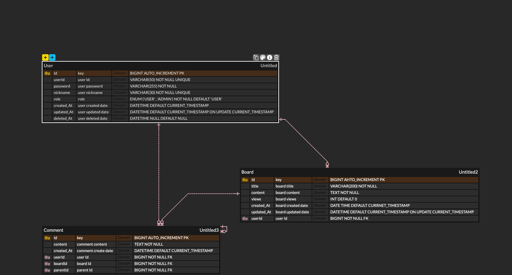

# 🗓️ 게시판 만들기

  간단하게 사용자들과 소통할 수 있는 게시판 서비스입니다.

## 프로젝트 기능 및 설계
 1. 회원가입 기능
    - 사용자는 회원가입을 할 수 있다.
    - 모든 사용자는 회원가입 시 기본 권한 USER(일반 권한)을 가진다.
    - 회원가입 시 아이디,비밀번호,닉네임을 입력받는다.
    - 아이디와 닉네임은 unique 해야 한다.
    - 비밀번호는 10자리 이상, 영문+숫자 조합이어야 한다.
   
  2. 로그인/로그아웃 기능
     - 사용자는 로그인을 할 수 있다.
     - 로그인 시 회원가입 때 사용한 아이디와 비밀번호가 일치해야 한다.
     - 로그아웃 시 세션이 종료된다.
    
  3. 마이페이지 기능
     - 사용자는 마이페이지에서 자신이 작성한 게시글과 댓글을 확인할 수 있다.
    
  4. 게시글 작성 기능
     - 로그인한 사용자는 누구나 글을 작성할 수 있다.
     - 사용자는 게시글 제목, 게시글 내용을 작성할 수 있다.

  5. 게시글 목록 조회 기능
     - 로그인하지 않은 사용자를 포함한 모든 사용자는 게시글 목록을 조회할 수 있다.
     - 게시글은 최신순으로 기본 정렬되며, 조회순 정렬도 가능하다.
     - 게시글은 **paging 처리(5개 단위)** 를 한다.
     - 게시글 목록 조회 시에는 게시글 제목, 작성자, 작성일, 조회수의 정보가 포함된다.
    
  6. 특정 게시글 조회 가능
     - 로그인하지 않은 사용자를 포함한 모든 사용자는 특정 게시글을 조회할 수 있다,.
     - 게시글 제목, 게시글 내용, 작성자, 작성일, 조회수가 함께 조회된다.
     - 특정 게시글 조회는 제목 또는 닉네임으로 조회할 수 있다.
     - 조회 시 게시글의 조회수가 1 증가한다.
    
  7. 댓글 작성 기능
     - 로그인한 사용자는 댓글을 작성할 수 있다.
     - 사용자는 댓글 내용을 작성할 수 있다.
     - 댓글은 특정 게시글에 연결된다.
     - 댓글에는 대댓글을 작성할 수 있으며, 대댓글은 최대 10개까지만 작성할 수 있다.
    
  8. 댓글 목록 조회 기능
     - 특정 게시글 조회 시 댓글 목록을 함께 조회힐 수 있다.
     - 댓글은 최신순으로 정렬되며, **paging 처리(5개 단위)** 로 한다.
     - 댓글 목록 조회 시 댓글 작성자, 댓글 내용, 댓글 작성일의 정보가 포함된다.
    

     ## ERD
     

     ## Trouble Shooting

     ### Teck Stack
     
 
         
         
         
        
      

  
   
  
  
